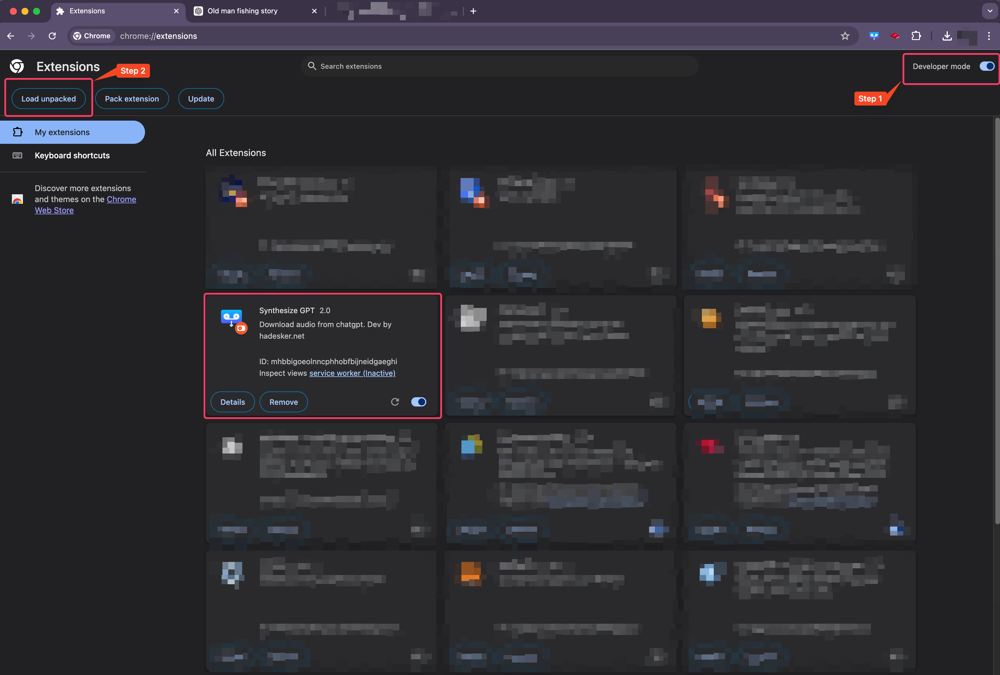
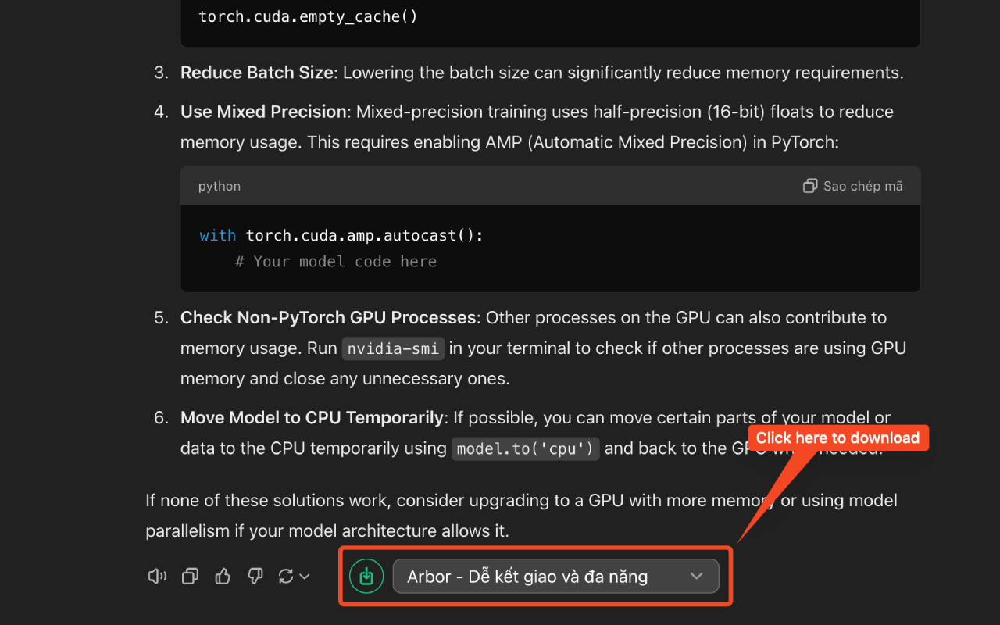

## Install extension from Store:
Chrome web store: https://chromewebstore.google.com/detail/synthesize-chatgpt/alhlbggjdnnmahajjndfeagfaecebphh

Firefox web store: https://addons.mozilla.org/firefox/addon/synthesize-chatgpt/

## Install extension from source
1. Goto: chrome://extensions/
2. Enable Developer mode (upper right corner)
3. Click Load unpacked button and browse to extension folder (which contains manifest.json file)
   

## Download audio
1. Goto https://chatgpt.com/ and login
2. Chat with ChatGPT then click the download button to download audio
   
